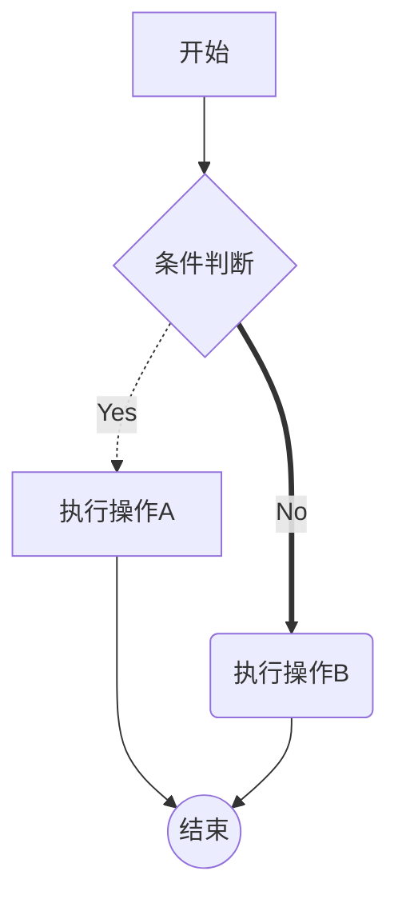
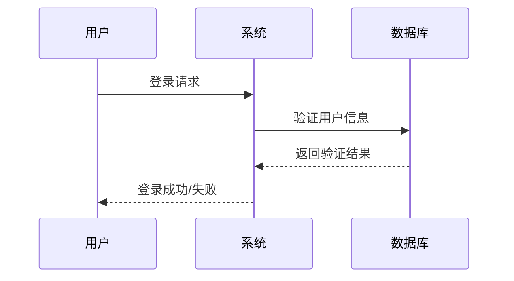
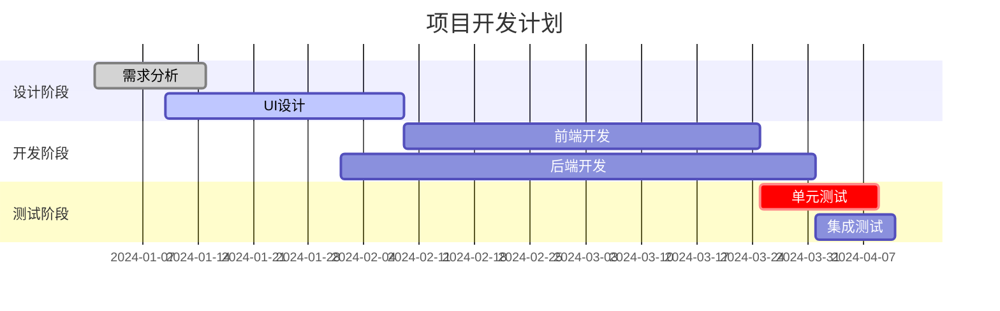
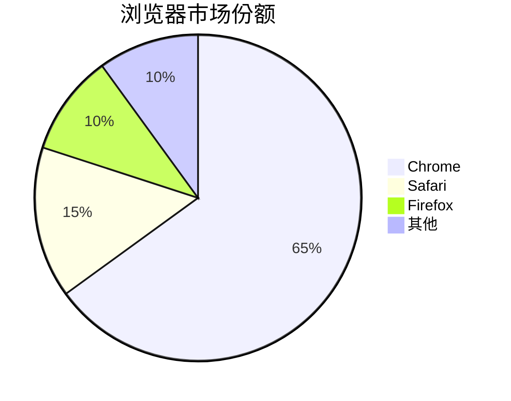
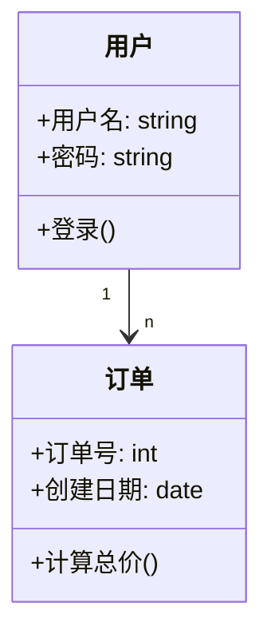
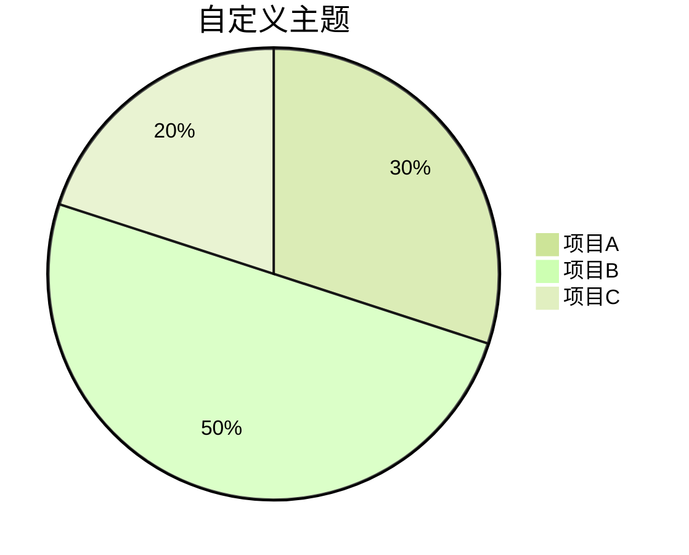
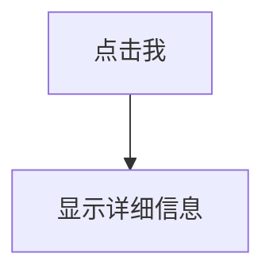

# Chart

支持的图表类型：

- 流程图 (Flowchart)
- 序列图 (Sequence Diagram)
- 类图 (Class Diagram)
- 状态图 (State Diagram)
- 甘特图 (Gantt Chart)
- 饼图 (Pie Chart)

## 流程图

方向：

- TD 或 TB：从上到下
- BT：从下到上
- RL：从右到左
- LR：从左到右

## 时序图与甘特图

## 饼图

## 类图

## 高级技巧

### 主体定制

### 交互式图表

