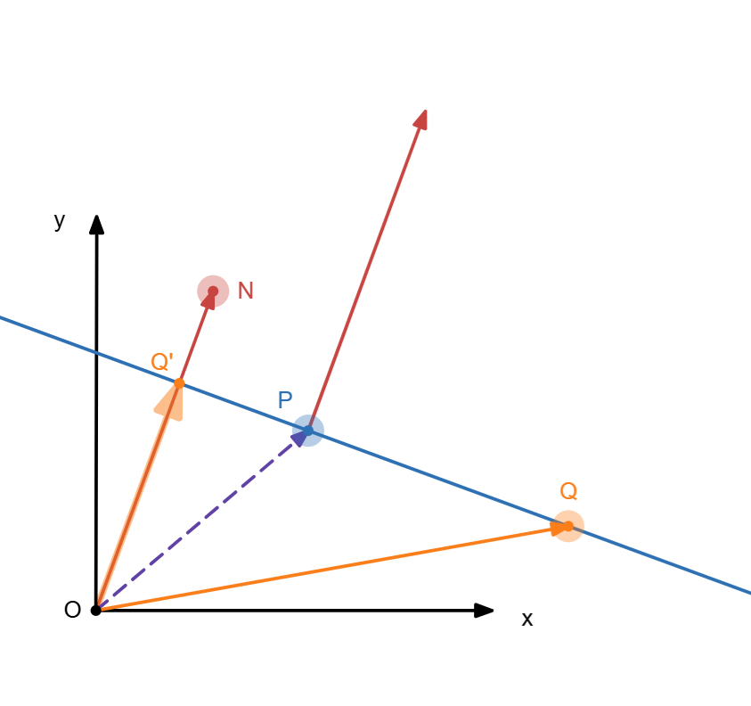
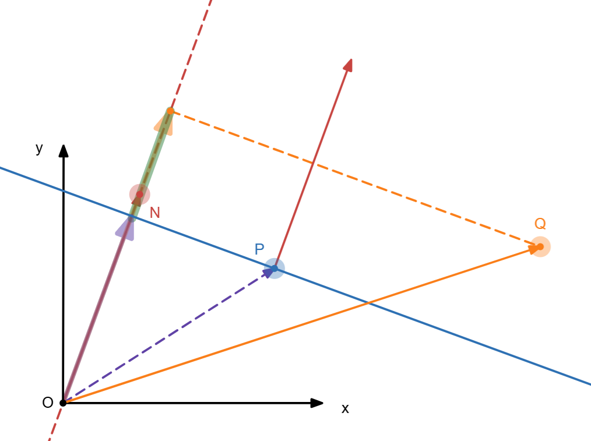

# 为什么点线距离的分子是点坐标代入？

> 前言
>
> 确实高中时想过这个问题，一直好奇坐标代入方程的含义是什么，但是之前都没有深入去想，今天想了一下

[TOC]

==page==

## 环境建立

$O$为平面直角坐标系的原点$(0,0)$

设直线为点法式，法向量$\vec{n}=(A,B)$，经过点$P=(x_0,y_0)$，其方程为：

$$A(x-x_0)+B(y-y_0)=0$$

这与一般式对应的上：

$$Ax+By+C=0$$

其中$C = -Ax_0-By_0$

不妨设$F(x,y) = \vec{n}\cdot(x,y) = Ax+By$  
则点法式可表示为：

$$F(x,y)=F(x_0,y_0)$$

==page==

## 几何意义

下面从几何角度推导
$$F(x,y)=F(x_0,y_0)$$
对于平面内任意一点$Q(x,y)$，有$\vec{OQ} = (x,y)$  
则函数$F(x,y) = \vec{n}\cdot\vec{OQ}$的几何意义是$\vec{OQ}$在$\vec{n}$方向上的投影乘以$\vec{n}$的模长
不妨设$G(x,y) = \frac{F(x,y)}{|\vec{n}|}$,几何意义便是投影向量长度。  
此时注意到直线上任意一点$Q(x,y)$满足$G(x,y)=G(x_0,y_0)$，如下图所示

:::center

图1 直线上点Q在n上投影OQ'
:::

$$G(x,y)=G(x_0,y_0)=|\vec{OQ'}|$$
即
$$\frac{F(x,y)}{|\vec{n}|} = \frac{F(x_0,y_0)}{|\vec{n}|}$$
化简得
$$F(x,y) = F(x_0,y_0)$$
故直线上任意一点满足方程$F(x,y) = F(x_0,y_0)$
而对于方程的任意解$M(x,y)$有

$$\vec{PM}\cdot\vec{n} = (A,B)\cdot(x-x_0,y-y_0) = Ax-Ax_0+By-By_0 $$
$$ = Ax+By-Ax_0-By_0 = F(x,y)-F(x_0,y_0)=0$$

==page==

## 点到线的距离

:::center

图2 点到线的距离
:::

见上图，绿色部分表示点$Q$到直线的距离$d$，可得：
$$
d = |G(x,y)-G(x_0,y_0)| = |\frac{F(x,y)-F(x_0,y_0)}{|\vec{n}|}|
$$

有一般式方程：$$Ax+By+C=F(x,y)-F(x_0,y_0)=0$$

得到
$$
d = |\frac{Ax+By+C}{|\vec{n}|}|
$$

同时也易得有向距离$\delta$的正负为什么能分辨点在直线的两侧 $\delta = G(x,y)-G(x_0,y_0)$ 当$Q$在直线上侧时$\delta$值为正的，反之为负的。
